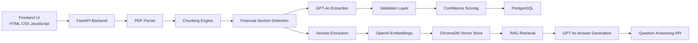
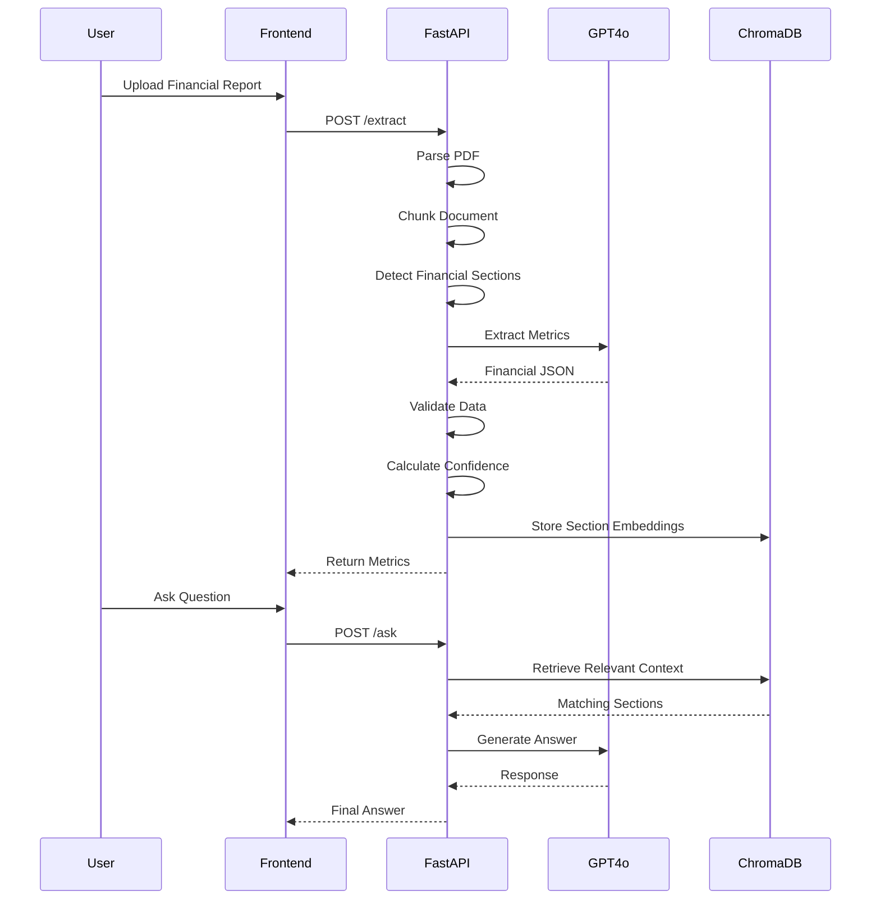

# Financial Document Extraction & RAG Platform

AI-powered Financial Document Extraction and Retrieval-Augmented Generation (RAG) platform built with GPT-4o, OpenAI Embeddings, ChromaDB, FastAPI, Docker, PostgreSQL, and AWS.

---

## Live Demo

### Frontend
http://financial-rag-frontend-ajay.s3-website.ap-south-1.amazonaws.com

### Backend API
http://13.235.115.168:8000/docs

---

## Project Overview

This platform automates the extraction of key financial metrics from annual reports (10-K PDFs) and enables intelligent question answering using Retrieval-Augmented Generation (RAG).

Users can:

- Upload financial reports
- Extract structured financial metrics
- Store financial data
- Generate vector embeddings
- Perform semantic search
- Ask natural language questions
- Receive GPT-4o-generated answers grounded in document context

---

# Architecture Diagram



---

# End-to-End Workflow



---

# Features

### Financial Document Extraction

- PDF Parsing
- Chunking Pipeline
- Financial Section Detection
- GPT-4o Structured Extraction
- JSON Output Validation
- Confidence Scoring

### Retrieval-Augmented Generation

- OpenAI Embeddings
- ChromaDB Vector Database
- Semantic Search
- Context-Aware Question Answering
- GPT-4o Response Generation

### Deployment

- Docker Containerization
- AWS EC2 Backend Deployment
- AWS S3 Static Frontend Hosting
- GitHub Actions CI Pipeline

---

# Technology Stack

| Layer | Technology |
|---------|------------|
| Frontend | HTML, CSS, JavaScript |
| Backend | FastAPI |
| LLM | GPT-4o |
| Embeddings | OpenAI text-embedding-3-small |
| Vector Database | ChromaDB |
| Database | PostgreSQL |
| Containerization | Docker |
| Cloud | AWS EC2 |
| Static Hosting | AWS S3 |
| CI/CD | GitHub Actions |

---

# Project Structure

```text
Financial-Document-Extraction-RAG
│
├── app/
│   ├── extractor.py
│   ├── rag.py
│   ├── repository.py
│   ├── validator.py
│   ├── confidence.py
│   ├── pdf_parser.py
│   └── main.py
│
├── frontend/
│   ├── index.html
│   ├── style.css
│   └── app.js
│
├── screenshots/
│   └── demo.png
│
├── tests/
│   ├── test_db.py
│   ├── test_pipeline.py
│   ├── test_qa.py
│   ├── test_rag.py
│   ├── test_search.py
│   ├── test_sections.py
│   ├── debug_sections.py
│   └── inspect_chunks.py
│
├── Dockerfile
├── requirements.txt
├── README.md
└── .github/workflows
```

---

# Application Demo


---

# Sample Capabilities

### Financial Metric Extraction

Extracts:

- Revenue
- Gross Margin
- Operating Income
- Net Income
- Total Assets
- Total Liabilities
- Shareholders Equity
- Cash & Cash Equivalents

### Question Answering

Example Questions:

```text
What was Apple's revenue in 2024?

What were Apple's total liabilities?

What was shareholder equity in 2024?

How much cash was used in financing activities?

What cash balance did Apple end fiscal 2024 with?
```

---

# Deployment Architecture

```text
User
 ↓
AWS S3 Static Website
 ↓
Frontend UI
 ↓
AWS EC2 Instance
 ↓
Docker Container
 ↓
FastAPI Application
 ↓
GPT-4o + OpenAI Embeddings
 ↓
ChromaDB
```

---

# Future Enhancements

- Multi-document support
- Historical trend analysis
- Financial ratio calculations
- Interactive dashboards
- Multi-company comparison
- Advanced RAG retrieval strategies
- Cloud-native vector database

---

# Author

Ajay Kumar Sathri

MS Computer Science Engineering
University of North Texas

GitHub:
https://github.com/ajaysathriai-afk

---

## Project Status

Production Ready

- Financial Extraction Working
- RAG Pipeline Working
- Dockerized
- AWS Deployed
- End-to-End Tested