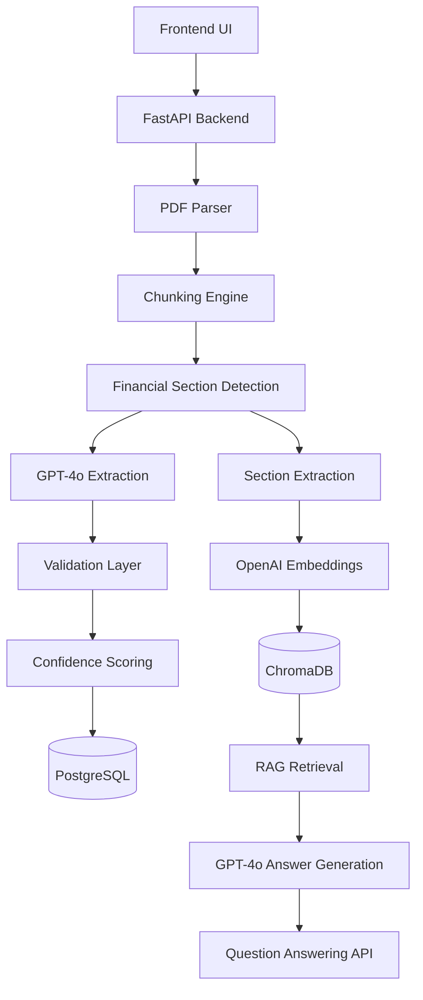
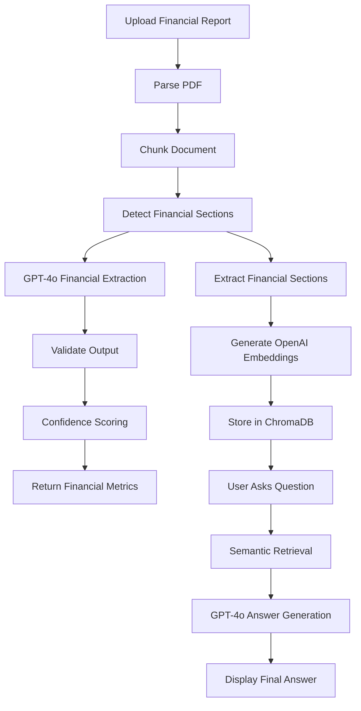
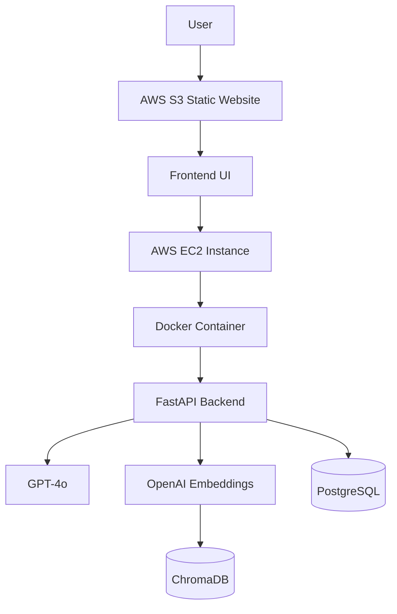

# Financial Document Extraction & RAG Platform

AI-powered Financial Document Extraction and Retrieval-Augmented Generation (RAG) platform built using GPT-4o, OpenAI Embeddings, ChromaDB, FastAPI, Docker, PostgreSQL, and AWS.

---

## 🌐 Live Demo

| Service | URL |
|---------|-----|
| Frontend | http://financial-rag-frontend-ajay.s3-website.ap-south-1.amazonaws.com |
| Backend API | http://13.235.115.168:8000 |
| API Docs | http://13.235.115.168:8000/docs |

---

## 📖 Project Overview

This platform automates extraction of key financial metrics from annual reports (10-K PDFs) and enables intelligent financial question answering using Retrieval-Augmented Generation (RAG).

### Core Capabilities

- Upload Financial Reports (10-K PDFs)
- Extract Financial Metrics using GPT-4o
- Validate Structured Output with Confidence Scores
- Generate OpenAI Embeddings
- Store Vectors in ChromaDB
- Perform Semantic Search
- Ask Natural Language Questions
- Receive Context-Aware Answers

---

## 🏗️ Architecture Diagram



---

## 🔄 End-to-End Workflow



---

## ☁️ Deployment Architecture



---

## 🚀 Features

### Financial Extraction
- PDF Parsing and Intelligent Chunking
- Financial Statement Detection
- GPT-4o Structured Extraction
- Validation Layer with Confidence Scoring

### Retrieval-Augmented Generation (RAG)
- OpenAI Embeddings
- ChromaDB Vector Search
- Semantic Retrieval
- Context-Aware GPT-4o Responses

### Cloud Deployment
- Dockerized Backend on AWS EC2
- AWS S3 Static Frontend Hosting
- Public REST APIs
- GitHub Actions CI/CD

---

## 🛠️ Technology Stack

| Layer | Technology |
|-------|------------|
| Frontend | HTML, CSS, JavaScript |
| Backend | FastAPI, Python |
| LLM | GPT-4o |
| Embeddings | OpenAI text-embedding-3-small |
| Vector Database | ChromaDB |
| Database | PostgreSQL |
| Containerization | Docker |
| Cloud | AWS EC2 |
| Static Hosting | AWS S3 |
| CI/CD | GitHub Actions |

---

## 📂 Project Structure

```text
Financial-Document-Extraction-RAG/
│
├── app/
│   ├── main.py
│   ├── extractor.py
│   ├── rag.py
│   ├── pdf_parser.py
│   ├── validator.py
│   ├── confidence.py
│   └── repository.py
│
├── frontend/
│   ├── index.html
│   ├── style.css
│   └── app.js
│
├── screenshots/
│   └── demo.png
│
├── tests/
├── Dockerfile
├── requirements.txt
└── README.md
```

---

## 📊 Example Financial Metrics

The platform extracts key financial data from annual reports:

```json
{
  "company_name": "Apple Inc.",
  "fiscal_year": 2024,
  "revenue": 391035,
  "gross_margin": 180683,
  "operating_income": 123216,
  "net_income": 93736,
  "total_assets": 364980,
  "total_liabilities": 308030,
  "shareholders_equity": 56950,
  "cash_and_cash_equivalents": 29943,
  "confidence_score": 1.0,
  "review_required": false
}
```

---

## 💬 Sample Questions

- What was Apple's revenue in 2024?
- What were Apple's total liabilities?
- What was shareholder equity in 2024?
- How much cash was used in financing activities?
- What cash balance did Apple end fiscal 2024 with?
- What was Apple's operating income in fiscal year 2024?

---

## ✅ Project Status

| Feature | Status |
|---------|--------|
| Financial Extraction | ✅ Working |
| GPT-4o Integration | ✅ Working |
| OpenAI Embeddings | ✅ Working |
| ChromaDB Vector Search | ✅ Working |
| RAG Pipeline | ✅ Working |
| Dockerized Backend | ✅ Working |
| AWS EC2 Deployment | ✅ Working |
| AWS S3 Frontend | ✅ Working |
| End-to-End Tested | ✅ Working |

---

## 🔮 Future Enhancements

- Multi-Document Analysis and Multi-Company Comparison
- Financial Trend Analysis with Interactive Dashboards
- Advanced RAG Strategies and Financial Ratio Calculations
- Production Monitoring and Observability

---

## 👨‍💻 Author

**Ajay Kumar Sathri**

MS in Computer Science — University of North Texas

GitHub: https://github.com/ajaysathriai-afk