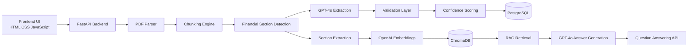
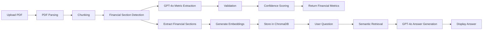
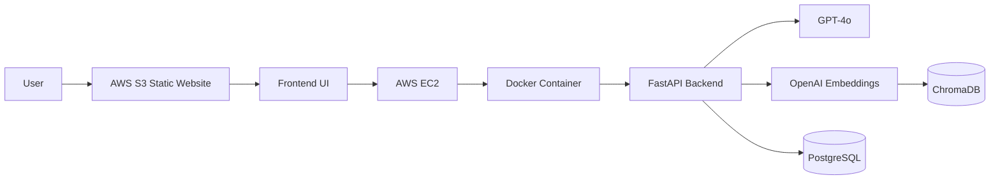

# Financial Document Extraction & RAG Platform

AI-powered Financial Document Extraction and Retrieval-Augmented Generation (RAG) platform built using GPT-4o, OpenAI Embeddings, ChromaDB, FastAPI, Docker, PostgreSQL, and AWS.

---

## Live Demo

### Frontend
http://financial-rag-frontend-ajay.s3-website.ap-south-1.amazonaws.com

### Backend API
http://13.235.115.168:8000/docs

---

# Application Demo


---

# Project Overview

This platform automates the extraction of key financial metrics from annual reports (10-K PDFs) and enables intelligent question answering using Retrieval-Augmented Generation (RAG).

Users can:

- Upload financial reports
- Extract structured financial metrics
- Generate confidence scores
- Store financial information
- Create vector embeddings
- Perform semantic search
- Ask natural language questions
- Receive GPT-4o generated answers grounded in document context

---

# Architecture Diagram



---

# End-to-End Workflow



---

# Key Features

## Financial Document Extraction

- PDF Parsing
- Intelligent Chunking
- Financial Section Detection
- GPT-4o Financial Metric Extraction
- JSON Validation
- Confidence Scoring
- Structured Financial Output

## Retrieval-Augmented Generation (RAG)

- OpenAI Embeddings
- ChromaDB Vector Database
- Semantic Search
- Context-Aware Retrieval
- GPT-4o Answer Generation

## Cloud Deployment

- Docker Containerization
- AWS EC2 Deployment
- AWS S3 Static Website Hosting
- GitHub Actions CI Pipeline

---

# Technology Stack

| Layer | Technology |
|---------|------------|
| Frontend | HTML, CSS, JavaScript |
| Backend | FastAPI |
| LLM | GPT-4o |
| Embeddings | OpenAI text-embedding-3-small |
| Vector Database | ChromaDB |
| Database | PostgreSQL |
| Containerization | Docker |
| Cloud | AWS EC2 |
| Static Hosting | AWS S3 |
| CI/CD | GitHub Actions |

---

# Project Structure

```text
Financial-Document-Extraction-RAG
│
├── app/
│   ├── extractor.py
│   ├── rag.py
│   ├── repository.py
│   ├── validator.py
│   ├── confidence.py
│   ├── pdf_parser.py
│   └── main.py
│
├── frontend/
│   ├── index.html
│   ├── style.css
│   └── app.js
│
├── screenshots/
│   └── demo.png
│
├── tests/
│   ├── test_db.py
│   ├── test_pipeline.py
│   ├── test_qa.py
│   ├── test_rag.py
│   ├── test_search.py
│   ├── test_sections.py
│   ├── debug_sections.py
│   └── inspect_chunks.py
│
├── Dockerfile
├── requirements.txt
├── README.md
└── .github/workflows
```

---

# Sample Financial Metrics Extracted

The platform extracts:

- Revenue
- Gross Margin
- Operating Income
- Net Income
- Total Assets
- Total Liabilities
- Shareholders Equity
- Cash & Cash Equivalents

Example Output:

```json
{
  "company_name": "Apple Inc.",
  "fiscal_year": 2024,
  "revenue": 391035,
  "gross_margin": 180683,
  "operating_income": 123216,
  "net_income": 93736,
  "total_assets": 364980,
  "total_liabilities": 308030,
  "shareholders_equity": 56950,
  "cash_and_cash_equivalents": 29943,
  "confidence_score": 1,
  "review_required": false
}
```

---

# Sample Questions

Users can ask questions such as:

```text
What was Apple's revenue in 2024?

What were Apple's total liabilities?

What was shareholder equity in 2024?

How much cash was used in financing activities?

What cash balance did Apple end fiscal 2024 with?

What was Apple's operating income in fiscal year 2024?
```

---

# Deployment Architecture



---

# Future Enhancements

- Multi-document support
- Financial trend analysis
- Multi-company comparison
- Interactive dashboards
- Advanced RAG retrieval strategies
- Financial ratio calculations
- Cloud-native vector databases
- Production monitoring and observability

---

# Author

**Ajay Kumar Sathri**

MS in Computer Science Engineering  
University of North Texas

GitHub:
https://github.com/ajaysathriai-afk

---

# Project Status

✅ Financial Extraction Working

✅ RAG Pipeline Working

✅ OpenAI Embeddings Integrated

✅ ChromaDB Vector Search Working

✅ Dockerized

✅ AWS EC2 Deployed

✅ AWS S3 Hosted Frontend

✅ GitHub Actions CI Pipeline

✅ End-to-End Tested