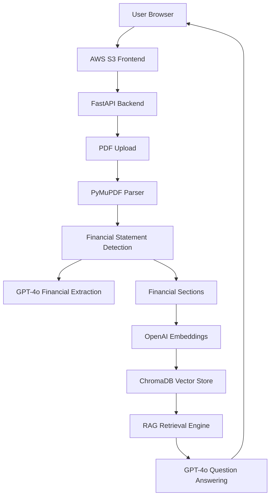
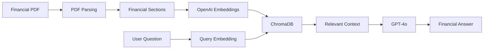
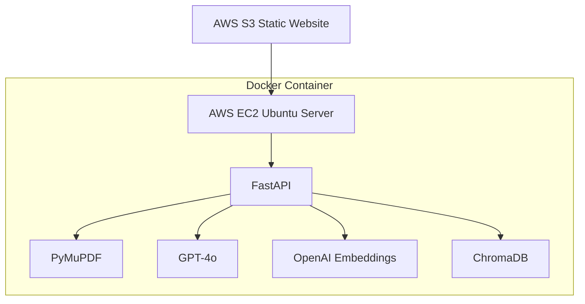
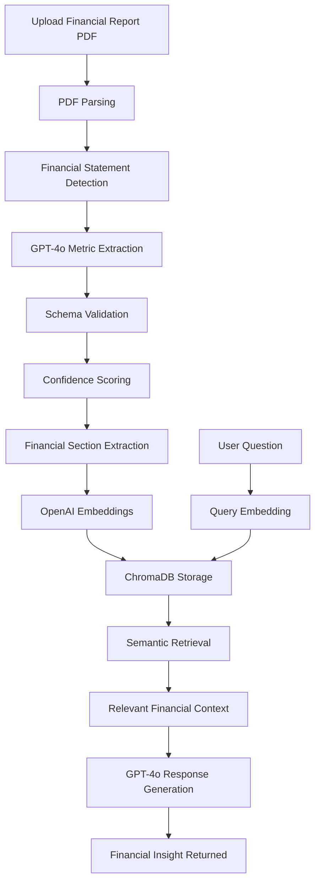
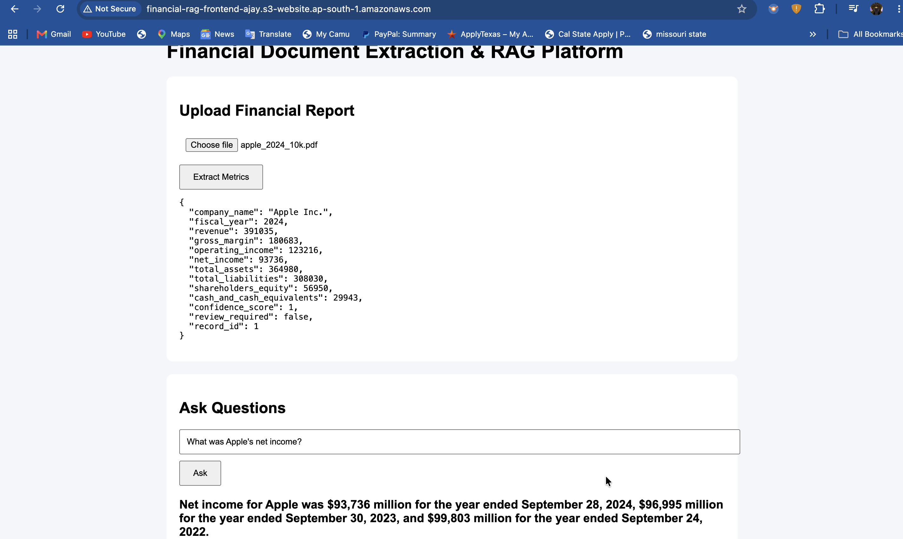

# Financial Document Extraction & RAG Platform

AI-powered Financial Intelligence Platform that automatically extracts financial metrics from annual reports (10-K PDFs) and enables natural language financial question answering using Retrieval-Augmented Generation (RAG).

Built using FastAPI, GPT-4o, OpenAI Embeddings, ChromaDB, Docker, AWS EC2, and AWS S3.

---

# 🌐 Live Deployment

## Frontend

http://financial-rag-frontend-ajay.s3-website.ap-south-1.amazonaws.com

## Backend API

http://13.235.115.168:8000

## API Documentation

http://13.235.115.168:8000/docs

---

# 🚀 Features

### Financial Metric Extraction

Automatically extracts:

* Revenue
* Gross Margin
* Operating Income
* Net Income
* Total Assets
* Total Liabilities
* Shareholders Equity
* Cash & Cash Equivalents

---

### Retrieval-Augmented Generation (RAG)

* Financial section detection
* OpenAI Embeddings
* ChromaDB Vector Search
* Semantic Retrieval
* GPT-4o Question Answering
* Context-Aware Responses

---

### Production Deployment

* Dockerized Application
* AWS EC2 Hosting
* AWS S3 Frontend
* Public REST APIs
* Persistent ChromaDB Storage

---

# 🏗️ System Architecture



---

# 🧠 RAG Architecture



---

# ☁️ AWS Production Architecture



---

# 🔄 End-to-End Workflow



---

# 📸 Demo



---

# 🛠️ Technology Stack

## Frontend

* HTML
* CSS
* JavaScript
* AWS S3

### Backend

* Python
* FastAPI
* Pydantic

### AI & LLM

* GPT-4o
* OpenAI API
* Prompt Engineering

### Embeddings

* OpenAI text-embedding-3-small

### Vector Database

* ChromaDB

### Document Processing

* PyMuPDF

### Infrastructure

* Docker
* AWS EC2
* AWS S3
* Ubuntu Linux

---

# 📡 API Endpoints

## Health Check

```http
GET /
```

---

## Financial Extraction

```http
POST /extract
```

Upload a Financial PDF and receive structured financial metrics.

---

## Question Answering

```http
POST /ask
```

Example:

```json
{
  "question": "What was Apple's revenue in 2024?"
}
```

---

# 📂 Project Structure

```text
Financial-Document-Extraction-RAG

├── app
│   ├── extractor.py
│   ├── rag.py
│   ├── pdf_parser.py
│   ├── confidence.py
│   ├── validator.py
│   ├── repository.py
│   ├── database.py
│   └── main.py
│
├── frontend
│   ├── index.html
│   ├── style.css
│   └── app.js
│
├── chroma_db
├── screenshots
│   └── demo.png
│
├── Dockerfile
├── requirements.txt
└── README.md
```

---

# 🎯 Key Achievements

* Built an End-to-End Financial Intelligence Platform
* Developed GPT-4o powered Financial Metric Extraction
* Implemented Retrieval-Augmented Generation (RAG)
* Integrated OpenAI Embeddings with ChromaDB
* Developed Semantic Search over Financial Statements
* Built Natural Language Financial Question Answering
* Containerized using Docker
* Deployed Backend on AWS EC2
* Hosted Frontend on AWS S3
* Implemented Validation & Confidence Scoring Pipelines
* Solved Real-World Deployment Challenges involving Docker, AWS Networking, CORS, OpenAI APIs, and Vector Database Persistence

---

# 🔮 Future Enhancements

* Multi-Document Support
* Multi-Company Analysis
* Historical Financial Trends
* Financial Dashboard & Visualizations
* Pinecone Integration
* Authentication & Authorization
* Role-Based Access Control
* Financial Analytics Engine

---

# 📈 Project Status

### Version 1.0

✅ Production Deployed

✅ AWS Hosted

✅ Dockerized

✅ GPT-4o Integrated

✅ RAG Enabled

✅ OpenAI Embeddings

✅ ChromaDB Vector Search

✅ Portfolio Ready

---

# 👨‍💻 Author

### Ajay Kumar Sathri

AI Engineer | Generative AI | Machine Learning | Full Stack Development

GitHub:
https://github.com/ajaysathriai-afk

---

⭐ If you found this project useful, consider giving it a star.
